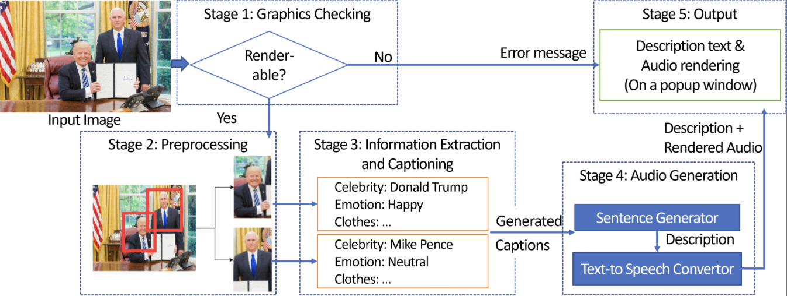

Alpha quality: Insufficiently refined to be tested by end-users.

This handler manages information generated by several preprocessors: `object-detector`, `expression-recognition`, `clothes-detector`, `celebrity-detector`, and `caption-recognition`.

 The handler follows these steps:

 ## Step 1
 Initially, it determines whether the input image contains people by referring to the output generated by `object-detector`, `semantic-segmentation`, and `graphic-tagger`. The code for this determination can be found in `check.py`.

 ## Step 2
 If the aforementioned AI models detect people, it then determines the number of people in the image. For a single person in the image, `single_person.py` processes the information. For two people, `two_people.py` processes the information, and for other cases with multiple people, `multiple.py` handles the processing. This involves combining outputs from specialized AI models such as `expression-recognition`, `clothes-detector`, and `celebrity-detector` to form a coherent sentence.

 ## Step 3
 The processed sentence is then concatenated with a generated caption in `people_handler.py.` Only the portion of the caption containing information about actions and scenes in the image is appended. This information is obtained from [`find_subject_object.py.`](https://github.com/rock3125/enhanced-subject-verb-object-extraction/blob/master/subject_verb_object_extract_test.py)

 The following is a pictorial representation of the handler
 


## A few things to note
This handler would not work if the any one preprocessors is disabled:
1. Semantic Segmentation
2. Object Detection
3. Celebrity detector
4. Emotion recognition
5. Clothes Detector
6. Caption Detector

For additional details about the design of the handler and the expected performance, please refer the [following thesis](https://srl.mcgill.ca/publications/thesis/2023-MASTER-Akut.pdf)

## TODO: Add handler and required preprocessors to docker-compose.yml
This handler and the required preprocessors are not currently in the docker-compose.yml for the overall project. To enable them, they would need to be added, via an update of the following service definitions:

```
    people-handler:
        image: ghcr.io/shared-reality-lab/image-handler-people:unstable
        labels:
            ca.mcgill.a11y.image.handler: enable


    clothes-detector:
        image: ghcr.io/shared-reality-lab/image-preprocessor-clothes-detector:unstable
        deploy:
            resources:
                reservations:
                    devices:
                    - driver: nvidia
                      device_ids: ['1']
                      capabilities: ["gpu", "utility", "compute"]
        labels:
            ca.mcgill.a11y.image.preprocessor: 5
            ca.mcgill.a11y.image.port: 5000

    celebrity-detector:
        image: ghcr.io/shared-reality-lab/image-preprocessor-celebrity-detector:unstable
        labels:
            ca.mcgill.a11y.image.preprocessor: 5
            ca.mcgill.a11y.image.port: 5000
        env_file:
            - ./config/azure-api.env
            
            
    emotion-recognition:
        image: ghcr.io/shared-reality-lab/image-preprocessor-emotion-recognition:unstable
        labels:
            ca.mcgill.a11y.image.preprocessor: 5
            ca.mcgill.a11y.image.port: 5000
```
