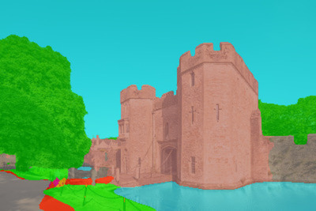

## Semantic segmentation models review

Romain Bazin, February 2023

## Introduction

The current semantic segmentation system used in IMAGE is [SemSeg](https://github.com/hszhao/semseg), released in 2018. Since then, multiple frameworks and models have been released.

The goal of this document is to review the possible replacements for SemSeg as well as to assess if it’s worth replacing it.

## Possible candidates

Here is the list of the most promising possible replacements to semseg, according to [Papers with Code](https://paperswithcode.com/task/semantic-segmentation) and number of stars on GitHub:

* [MMsegmentation](https://github.com/open-mmlab/mmsegmentation), OpenMMlab’s framework (5.2 stars on GH)
* [PadleSeg](https://github.com/PaddlePaddle/PaddleSeg), PaddlePaddle’s semantic segmentation framework (6.4 stars on GH)
* [Pytorch Segmentation models](https://github.com/qubvel/segmentation_models.pytorch#architectures), semantic segmentation framework (6.8 stars on GH)
* [Detectron2](https://github.com/facebookresearch/detectron2), FAIR’s detection and segmentation framework (24k stars on GH)
* [Mseg](https://github.com/mseg-dataset/mseg-semantic), stand alone model trained on MSEG dataset, not a framework (413 stars on GH)

## Evaluation method

I will build my evaluation of the different frameworks on **quantitative**, **qualitative** and **visual criteria**.

### Quantitative

* **Computation time** : max 3s for segmentation of one image, no matter its size.
* **mIoU**: mean Intersection over Union metric, main evaluation metric used in semantic segmentation benchmarks (higher is better). See [definition](https://huggingface.co/spaces/evaluate-metric/mean_iou).
* **GPU Memory** : should take as little as possible, better if under 12 GB.

I will use the benchmark metrics self-evaluated by the frameworks on **[ADE20K](https://paperswithcode.com/dataset/ade20k)** (150 segmentation classes) dataset, commonly used in semantic segmentation evaluations.

On IMAGE-test-graphic dataset, I will record the computation time as well as the GPU memory usage of randomly picked images. You can find the details on individual analyses.

### Qualitative

* **Amount of Support**: the framework should still receive support in the future, like new models, technical updates or bug fixes.
* **Documentation**: having a clear and easy-to-follow documentation would save time during the initial setup, for fixing issues and possible improvements of the system.
* **Ease of use** : the framework’s API should be easy to use. Modularity would be a plus as it could facilitate possible future improvements or changes. 
* **License**: has to be permissive (e.g : MIT, Apache 2).
* **Distributed inference and training** : If the framework supports distributed inference out of the box, we could drastically increase the speed of the predictions. If the project was get more GPUs, we would need this feature to fully make use of them.

### Visually

To visually compare the segmentation frameworks, I randomly picked images from IMAGE-test-graphic set. The images are the following :

bbq (2848x4488)

boris.jpg (416x624)

castle.jpg (533x799)

airport.jpg (2833x4250)

apple.jpg (6000x4000)

We note that they are of very different sizes, context, and amount of details.

All of the visual tests were performed on **Unicorn**, using the **TitanXp GPU**(12GB RAM). 

## Aggregated results

### Quantitative

<table>
  <tr>
   <td><strong>Framework name</strong>
   </td>
   <td><strong>mIoU (ADE20K)</strong>
   </td>
   <td><strong>GPU memory usage</strong>
   </td>
  </tr>
  <tr>
   <td>MMsegmentation
   </td>
   <td>53.08
   </td>
   <td>&lt; 12 GB
   </td>
  </tr>
  <tr>
   <td>PaddleSegmentation
   </td>
   <td>45.48
   </td>
   <td>Up to 200 GB for biggest image
   </td>
  </tr>
  <tr>
   <td>Mseg
   </td>
   <td>49.2
   </td>
   <td>&lt; 12 GB
   </td>
  </tr>
  <tr>
   <td>SemSeg
   </td>
   <td>42.03
   </td>
   <td>&lt; 12 GB
   </td>
  </tr>
</table>

It is to be noted that both frameworks expose a lot of different models to be used, the performance reported in this table are the ones for the best models I found that fit in memory and that were trained on ADE20K.

I don’t report the speed here because the self-evaluations made by these frameworks are computed on different hardware.

I didn’t compare Detectron2 and pytorch-segmentation because they didn’t allow semantic segmentation out of the box.

### Qualitative

<table>
  <tr>
   <td><strong>Framework name</strong>
   </td>
   <td><strong>Support</strong>
   </td>
   <td><strong>Documentation</strong>
   </td>
   <td><strong>Ease of use</strong>
   </td>
   <td><strong>License</strong>
   </td>
   <td><strong>Pretrained weights</strong>
   </td>
   <td><strong>DDP</strong>
   </td>
  </tr>
  <tr>
   <td>MMsegmentation
   </td>
   <td>Regular
   </td>
   <td>Extensive and clear
   </td>
   <td>Very easy
   </td>
   <td>Appache-2
   </td>
   <td>Encoders and decoders
   </td>
   <td>Fully distributed training and inference
   </td>
  </tr>
  <tr>
   <td>PaddleSeg
   </td>
   <td>Regular
   </td>
   <td>Extensive, not so clear
   </td>
   <td>Very easy 
   </td>
   <td>Appache-2
   </td>
   <td>Encoders and decoders
   </td>
   <td>Fully distributed training and inference
   </td>
  </tr>
  <tr>
   <td>Mseg
   </td>
   <td>None
   </td>
   <td>Very basic
   </td>
   <td>Not easy
   </td>
   <td>Permissive
   </td>
   <td>Encoder and decoder
   </td>
   <td>Only DataParallel
   </td>
  </tr>
  <tr>
   <td>Pytorch segmentation
   </td>
   <td>Regular
   </td>
   <td>Extensive and clear
   </td>
   <td>Very easy
   </td>
   <td>MIT
   </td>
   <td>Only encoder
   </td>
   <td>Only DataParallel
   </td>
  </tr>
  <tr>
   <td>Detectron2
   </td>
   <td>Regular
   </td>
   <td>Extensive and clear but no tutorial for semantic segmentation
   </td>
   <td>Not easy for semantic segmentation
   </td>
   <td>Permissive
   </td>
   <td>Encoder and decoder
   </td>
   <td>Distributed inference
   </td>
  </tr>
</table>

## Individual analyses

### SemSeg

SemSeg is the current model implemented. We’ll take a look at its performance and consider it as the baseline for the comparison.

Here is the visualization of its segmentation :

Classes found : plant (yellow), person (red), tree (blue)

Classes found : sky (red), building (blue), floor (green), tree (yellow), water (pink)

Classes found : person (blue), wall (red), flag (green), base (yellow)

The current model is fast (runs in less than 1 sec on all images), but its segmentation quality is quite low on some images like Boris and Apple, where it struggles deciphering people from objects or the background.

**Note** : Two segmented images are missing (bbq and airport) because I couldn’t make the pipeline work for these images.

### Mseg

Mseg is in fact not a model but a dataset, which was used to train renown segmentation models like PSnet models with HRnet backbones. In the [repo](https://github.com/mseg-dataset/mseg-semantic), the authors advertise that the best results are obtained by using the biggest model (1080p), with the lowest rescaling size (360p), and using the multi-scaling strategy.

Some problems that occurred with this configuration :

* multi-scaling demands too much GPU RAM (more than 16GB for most images from the test graphic test set)
* multi-scaling slows the segmentation tremendously (up to more than 60s)

Thus, multi-scaling was abandoned in favor of single-scale inference

I ran the segmentation script on the five images from IMAGE-test-graphics, **for all possible configurations** ((model size, cropping size) pairs).

For the fastest configuration pair (smallest model, smallest cropping size), the computation time for each image is summarized in the following table :

<table>
  <tr>
   <td><strong>Image name</strong>
   </td>
   <td><strong>Computation time (s)</strong>
   </td>
  </tr>
  <tr>
   <td>boris
   </td>
   <td>6.27
   </td>
  </tr>
  <tr>
   <td>apple
   </td>
   <td>16.77
   </td>
  </tr>
  <tr>
   <td>airport
   </td>
   <td>22.22
   </td>
  </tr>
  <tr>
   <td>bbq
   </td>
   <td>14.99
   </td>
  </tr>
  <tr>
   <td>castle
   </td>
   <td>5.95
   </td>
  </tr>
</table>

We observe that the computation time is over at least twice more than the fixed limit of 3s, which **rules Mseg out of the comparison test**.

**Additional notes** :

For some images, the configuration pairs bigger than (720p model, 720p cropping) didn’t always fit on the TitanXP’s 12GB RAM, which resulted in an OOM error, even if the scripts already rescale the images for the model to use them.

Mseg paper was released in 2020, but I didn’t see any framework using this dataset or even other models being benchmarked on this dataset, which is concerning and might say something about its real-world possible use.

I still see a potential use for Mseg. As it’s a dataset, we could train lighter models from other frameworks on this dataset. This could result in a model able to determine more segments on images, because Mseg introduces more classes than other training datasets like ADE20K.

### MMsegmentation

MMsegmentation is a semantic segmentation module part of a broader framework, OpenMMLab, which is one of the most influential open-source computer vision framework.

It can boast having frequent and high quality support. The documentation is extensive and easy to use, there are tutorials to easily get started with the library. The high-level APIs make it easy to use.

The framework was made modular by essence, meaning you can replace any part of the model by another one, so you can easily make trade-offs between performance and resources used, without changing more than one line of code. Also, the available models are often updated with SOTA, which could allow us to improve our preprocessor performance without much effort in the future.

There are more than 50 different models that can be used for semantic segmentation, some are SOTA. To benchmark MMsegmentation, I used the following model configuration : [UBEIT (base)](https://github.com/open-mmlab/mmsegmentation/tree/master/configs/beit).

The following table summarizes the segmentation time for the selected images from IMAGE-test-graphics.

<table>
  <tr>
   <td><strong>Image name</strong>
   </td>
   <td><strong>Computation time (s)</strong>
   </td>
  </tr>
  <tr>
   <td>boris
   </td>
   <td>0.59
   </td>
  </tr>
  <tr>
   <td>airport
   </td>
   <td>0.64
   </td>
  </tr>
  <tr>
   <td>bbq
   </td>
   <td>0.62
   </td>
  </tr>
  <tr>
   <td>castle
   </td>
   <td>0.59
   </td>
  </tr>
  <tr>
   <td>apple
   </td>
   <td>1.09
   </td>
  </tr>
</table>

The maximum amount of GPU RAM used was 11 GB.

You can visualize the segmentation on the following images :

Classes found : person (dark pink), wall (gray), ceiling (dark yellow), table (brown), bottle (green), food (light yellow), plate (light pink), tray (???), floor (light brown), light (???)

Classes found : person (light red), wall (gray), curtain (blue), flag (light purple), base (yellow), signboard (light pink)

Classes found : building (light brown), wall (dark gray), sky (light opaque blue), tree (darker green), road (darker gray), water (light transparent blue), signboard (yellow), path (red), fence (darkest gray)

Classes found : person (pink), sky (blue), tree (dark green), grass (light green), basket (lighter green)

Classes found : person (pink), wall (gray), floor (brown), ceiling (light yellow), fence (yellow), monitor (blue), bag (green), bulletin board (light pink), signboard (darker pink), light (bright yellow)

**Additional notes :**

The license is permissive (apache-2) for the most part. Only 2 models rely on [NVIDIA licensing,](https://www.nvidia.com/en-us/research/inquiries/) which needs authorization from the company to use in proprietary research or software. I didn’t use these models in this review to remain in the permissive domain of the apache-2 license.

In addition to these segmented images, you can find the rest of IMAGE-test-graphic segmented images on unicorn at /home/rbazin/mmseg-preds-all

### Paddle Segmentation

Paddle segmentation is a framework that claims to be focused on easy deployment and optimization for industry-level machine learning systems.

The framework supports around 50 models out of the box, with different configurations and pretrained weights. Unfortunately, the vast majority of models have been pre-trained on the **Cityscapes dataset**, which allow for images to be segmented in only 19 classes. The training dataset that suits our needs is **ADE20K** which allows for segmentation in 150 classes. The fact that they have only 2 models pretrained on ADE20K is a huge con, because to benefit from most of their available models, we would need to train them ourselves on ADE20K.

I still tested the two models trained on ADE20K, as they had very similar results, I share only one of the two result tables.

Model used : [segmenter](https://github.com/PaddlePaddle/PaddleSeg/tree/release/2.7/configs/segmenter) (trained on ADE20K)

<table>
  <tr>
   <td><strong>Image Name</strong>
   </td>
   <td><strong>Time taken (s)</strong>
   </td>
   <td><strong>Memory allocated (GB)</strong>
   </td>
  </tr>
  <tr>
   <td>boris
   </td>
   <td>0.5
   </td>
   <td>0.8
   </td>
  </tr>
  <tr>
   <td>castle
   </td>
   <td>0.6
   </td>
   <td>0.8
   </td>
  </tr>
  <tr>
   <td>apple 
   </td>
   <td>OOM
   </td>
   <td>196
   </td>
  </tr>
  <tr>
   <td>bbq
   </td>
   <td>OOM
   </td>
   <td>50
   </td>
  </tr>
  <tr>
   <td>airport
   </td>
   <td>OOM
   </td>
   <td>50
   </td>
  </tr>
</table>

For high resolution images like apple, airport or bbq it returns an Out Of Memory (OOM) error. Pre-resizing the images might solve this problem but I didn’t try it because of time constraints and because I had enough evidence to discard the framework already.

### Pytorch semantic segmentation

Pytorch semantic segmentation provides high level APIs and pretrained **encoders** to easily train a semantic segmentation model on a **custom dataset**. In turn, it doesn’t provide any pretrained decoder, which doesn’t make it very useful in our case because it’s not usable out-of-the-box. To use this framework, we would need to **train a decoder** with the provided architecture and pretrained encoder on a custom dataset (which could be ADE20K or MSEG).

In my opinion, it’s not worth the effort based on the other frameworks' promising results.

### Detectron 2

Detectron2 is FAIR’s computer vision framework. It supports multiple tasks in computer vision. Unfortunately, it doesn’t support semantic segmentation out of the box. We could build a system for semantic segmentation on top of their panoptic segmentation module, as stated in this [GitHub issue](https://github.com/facebookresearch/detectron2/issues/1055).

In my opinion, it’s not worth the effort based on the other frameworks' promising results.

## Conclusion

In my opinion, it’s worth replacing the current standalone model (Semseg) by a newer semantic segmentation framework, because they bring modularity, which implies flexibility, support over time, ease of use and scalability.

My framework of choice would be **MMsegmentation**, which is open source, has a permissive license, exposes many models with pretrained weights (trained on ADE20K), has a modular architecture, is easy to use, has good documentation, and shows promising speed and accuracy.
